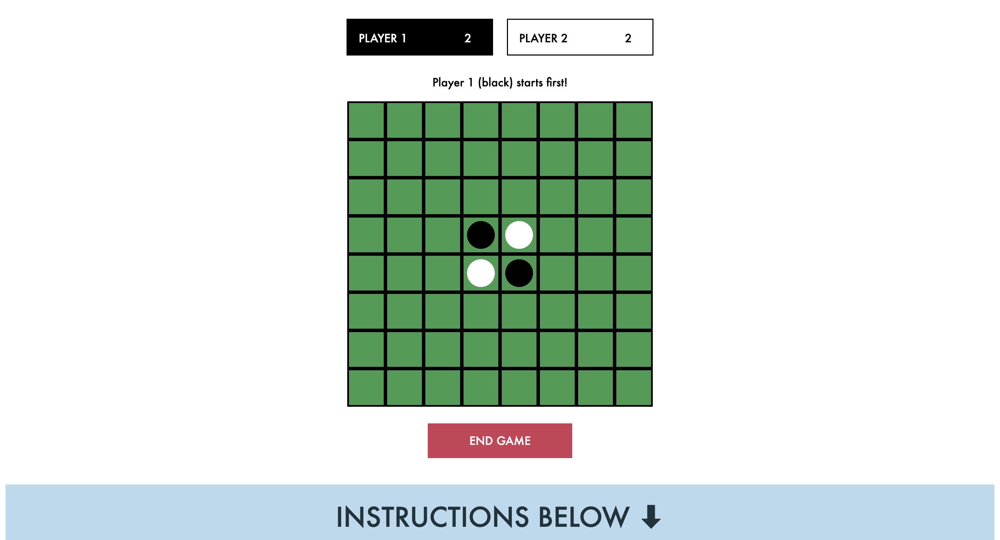
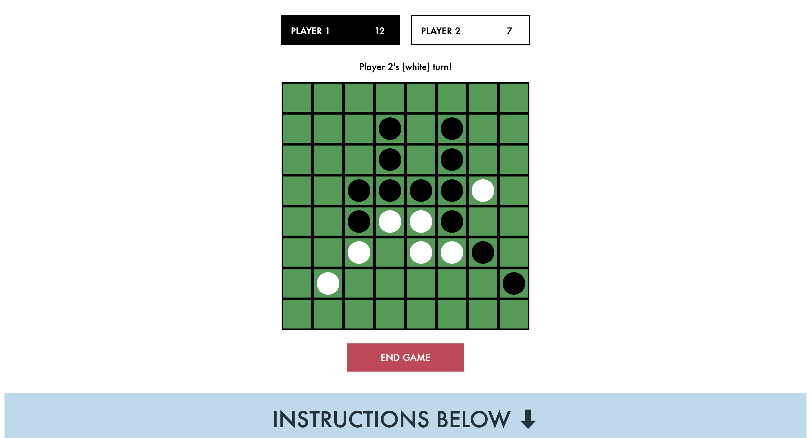
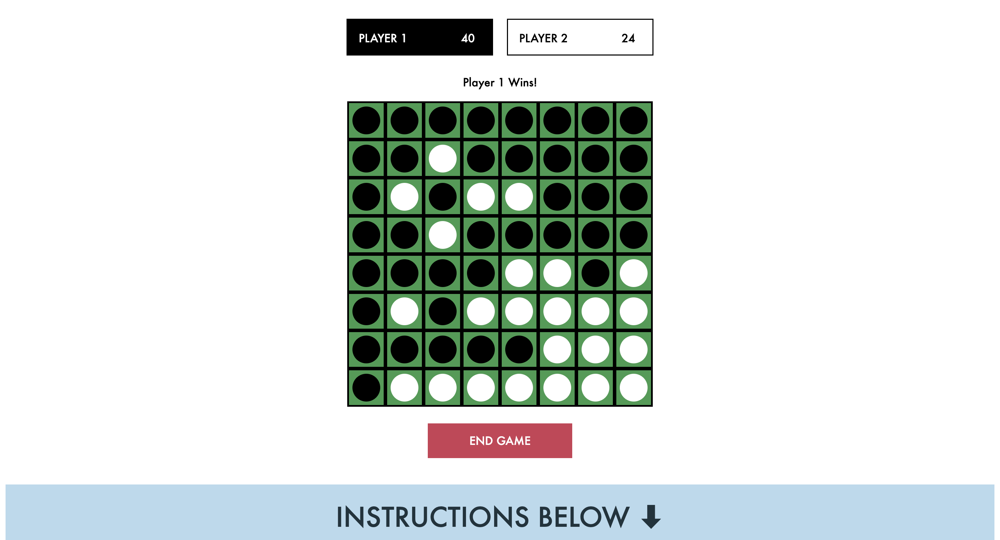

# Project Othello

### About The Game

<li> Number of players required: 2
<li> 8x8 square board with black and white discs
<li> Each player has a color - either black or white
<li> The aim of the game is to get more discs of your color on the board than the opponent.
<li> At the start of the game, 2 black discs and 2 discs will be placed in the middle of the 8 x 8 board.
<li> The player 1 (black disc) will make the first move to start capturing player 2’s (white disc) by surrounding the white disc(s) with a black disc either horizontally, vertically or diagonally.
<li> If the move is valid, player 2’s white disc(s) will be captured i.e flipped over to black, increasing the number of black discs on the number.
<li>The game ends when the board is full, or when one player forfeits
<li> The winner is determined by the most number of discs on the board when the game ends.

### How The Game Looks Like

Image 1 - Start of game 

Image 2 - Middle of game 

 Image 3 - End of game

### Technologies Used

1. HTML
2. CSS
3. JavaScript

### Next Steps

Opportunities for future enhancements

<li> Add a countdown timer for each player to make a move.
<li> Enhance the aesthetics of the board to make it appear in alternate shades of green.

### Citations
