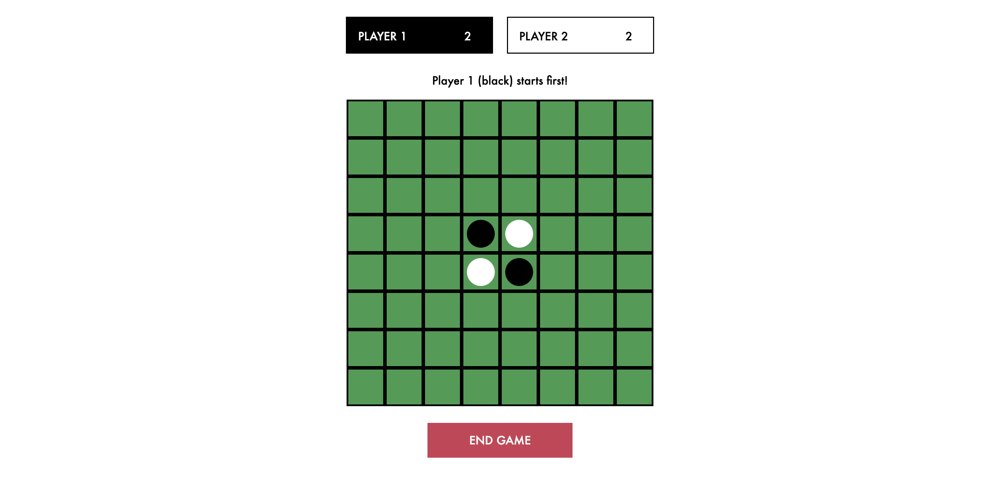
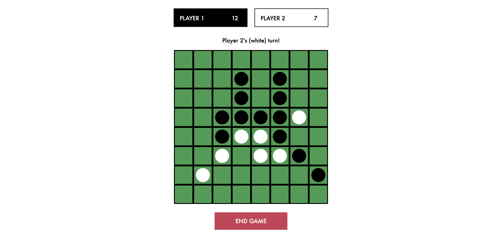
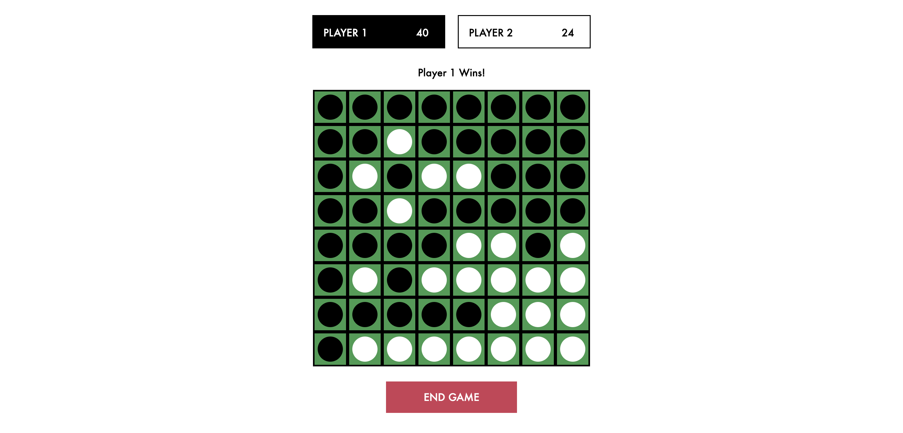

# Project: Othello

## ABOUT THE GAME

 Othello, or also commonly known as Reversi, is an old strategy board game involving two players. In this online version you can play it with a friend.

The players take turn in placing one disc (game piece) on the board, with their designated color facing up.

The aim of each move in Othello is to trap one or more of your opponent’s discs between two of your own. When you trap the discs, you can flip them over and thereby reverse their color to make them yours.

The game is over when both players have placed all their disks on the board, or when there are no more legal moves possible for either player. Whoever has the highest number of discs on the board is the winner.

<strong>CLICK TO PLAY > </strong>[Othello](https://samanthatan01.github.io/projectOthello/).

## SNIPPETS OF THE GAME

1. Start of game 

2. Middle of game 

3. End of game

## TECHNOLOGIES USED

1. HTML
2. CSS
3. JavaScript

## WHAT'S NEXT

<strong>Opportunities for future enhancements</strong>

<li> Add a countdown timer for each player to make a move.
<li> Enhance the aesthetics of the board to make it appear in alternate shades of green.
